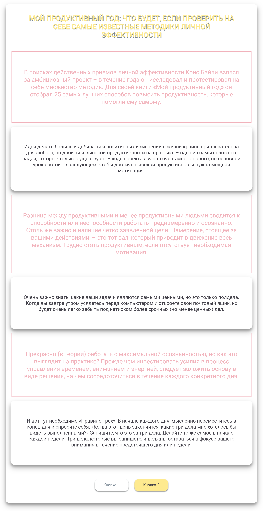

# text_with_jQuery

​

# Описание

Изменение внешенего вида проекта при нажатии на кнопки с использованием jQuery. 

При нажатии на первую кнопку у абзацев появляются рамки и меняется цвет текста.

​

При нажатии на вторую пропадают картинки.

​
